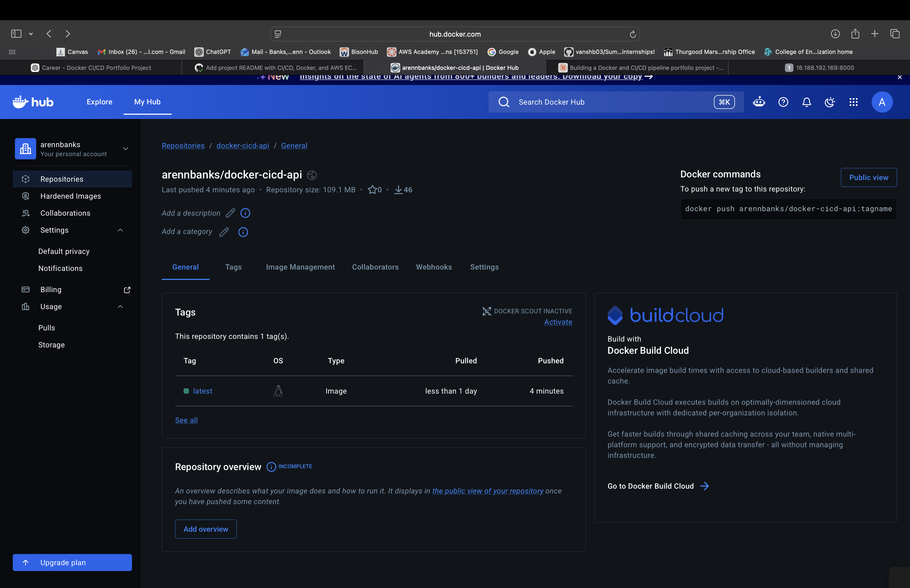
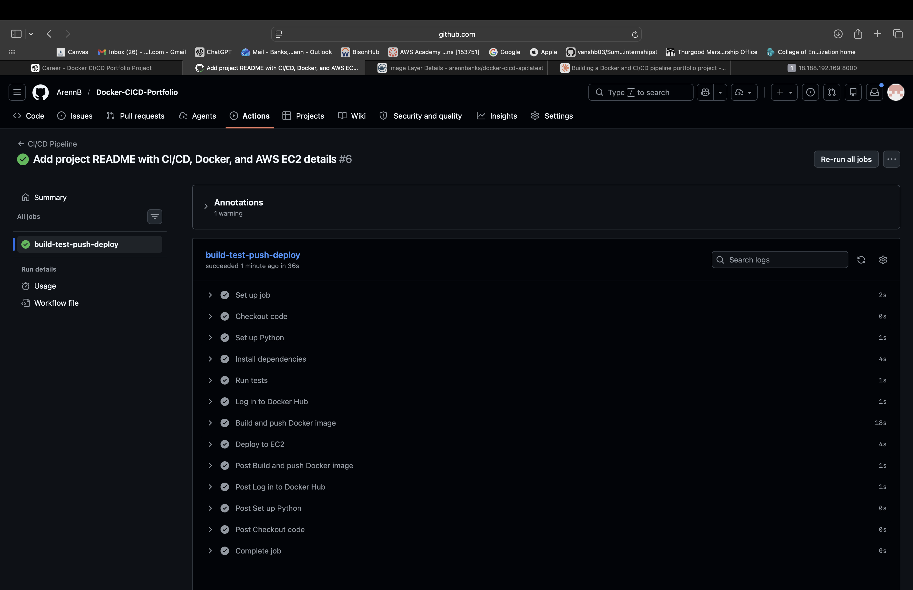
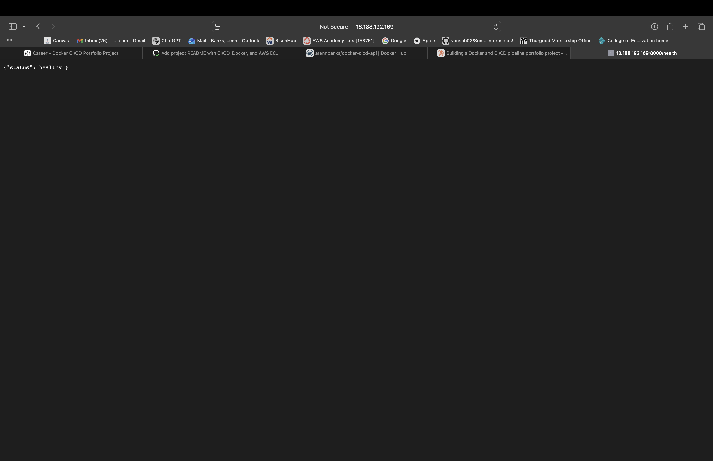
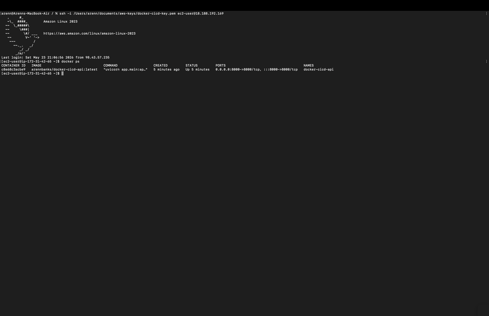

# Docker CI/CD Pipeline on AWS EC2

## Overview

This project demonstrates a complete cloud-native CI/CD workflow using FastAPI, Docker, GitHub Actions, Docker Hub, and AWS EC2.

The application is containerized with Docker, automatically tested with pytest, built and pushed to Docker Hub through GitHub Actions, and automatically redeployed to an AWS EC2 instance whenever code is pushed to the `main` branch.

---

# Tech Stack

* Python 3.11
* FastAPI
* Docker
* Pytest
* GitHub Actions
* Docker Hub
* AWS EC2
* Amazon Linux 2023
* SSH

---

# Features

* REST API built with FastAPI
* Docker containerization
* Automated testing with pytest
* CI/CD pipeline with GitHub Actions
* Docker Hub image publishing
* Automated EC2 deployment
* Health check endpoint
* Version endpoint
* Linux server deployment using SSH

---

# API Endpoints

| Endpoint   | Description             |
| ---------- | ----------------------- |
| `/`        | Root endpoint           |
| `/health`  | Health check endpoint   |
| `/version` | API version information |

---

# Live Deployment

## API

```text
http://18.188.192.169:8000
```
## Health Check

```text
http://18.188.192.169:8000/health
```

## API Version

```text
http://18.188.192.169:8000/version
```

---

# Architecture Diagram

```text
                 ┌─────────────────────┐
                 │   Developer Machine │
                 │   (Local Computer)  │
                 └──────────┬──────────┘
                            │
                     git push origin main
                            │
                            ▼
                 ┌─────────────────────┐
                 │       GitHub        │
                 │   Source Control    │
                 └──────────┬──────────┘
                            │
                            ▼
              ┌──────────────────────────┐
              │    GitHub Actions CI/CD │
              │                          │
              │ 1. Install dependencies  │
              │ 2. Run pytest tests      │
              │ 3. Build Docker image    │
              │ 4. Push image to Hub     │
              │ 5. SSH into EC2          │
              │ 6. Redeploy container    │
              └──────────┬───────────────┘
                         │
                         ▼
              ┌──────────────────────────┐
              │       Docker Hub         │
              │   Container Registry     │
              └──────────┬───────────────┘
                         │
                  docker pull latest
                         │
                         ▼
              ┌──────────────────────────┐
              │        AWS EC2           │
              │    Amazon Linux 2023     │
              │                          │
              │ Running Docker Container │
              └──────────┬───────────────┘
                         │
                         ▼
              ┌──────────────────────────┐
              │      FastAPI App         │
              │      Port 8000           │
              └──────────────────────────┘
```

---

# CI/CD Workflow

The GitHub Actions pipeline automatically runs whenever code is pushed to the `main` branch.

## Pipeline Stages

1. Checkout repository code
2. Set up Python environment
3. Install dependencies
4. Run automated tests
5. Authenticate with Docker Hub
6. Build Docker image
7. Push image to Docker Hub
8. SSH into AWS EC2
9. Pull latest Docker image
10. Restart running container

---

# Running Locally

## Clone repository

```bash
git clone https://github.com/ArennB/Docker-CICD-Portfolio.git
cd Docker-CICD-Portfolio
```

## Create virtual environment

```bash
python3 -m venv venv
source venv/bin/activate
```

## Install dependencies

```bash
pip install -r requirements.txt
```

## Run application

```bash
uvicorn app.main:app --reload
```

---

# Running with Docker

## Build image

```bash
docker build -t docker-cicd-api .
```

## Run container

```bash
docker run -p 8000:8000 docker-cicd-api
```

---

# Automated Deployment Process

Whenever code is pushed to the `main` branch:

```text
GitHub Push
→ GitHub Actions
→ Automated Tests
→ Docker Build
→ Push to Docker Hub
→ Automatic EC2 Deployment
→ Live Application Updated
```

---

# Skills Demonstrated

* Cloud Computing
* Linux Administration
* Docker Containerization
* CI/CD Automation
* Infrastructure Deployment
* AWS EC2
* GitHub Actions
* SSH Authentication
* Python Backend Development
* DevOps Workflows

---

# Future Improvements

* HTTPS with Nginx reverse proxy
* Custom domain name
* AWS ECS deployment
* Terraform infrastructure provisioning
* Kubernetes deployment
* Monitoring and logging
* Blue/green deployments
* Load balancing
---

# Screenshots

Below are screenshots demonstrating the working CI/CD pipeline, Docker Hub image, live deployment, and running container on AWS EC2:

## 1. Docker Hub Repository


## 2. GitHub Actions CI/CD Success


## 3. Live Health Endpoint


## 4. EC2 Instance Running Docker Container

